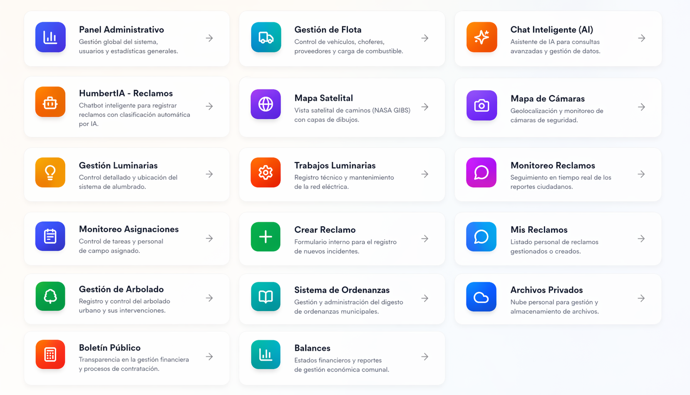

# 🏛️ HID — Plataforma Inteligente de Gestión Municipal

  

**HID (Humberto Primo Identidad Digital)** es una plataforma integral diseñada para la **gestión digital de municipios/comunas**, combinando herramientas de administración, monitoreo territorial, automatización de procesos y asistentes inteligentes basados en IA.

> Construido como un sistema real en uso, orientado a centralizar operaciones, mejorar la toma de decisiones y optimizar la comunicación entre áreas y ciudadanos.

---

## 🚀 ¿Qué resuelve?

* Centralización de sistemas municipales en una única plataforma
* Gestión eficiente de recursos, infraestructura y eventos
* Monitoreo en tiempo real del territorio
* Automatización de consultas mediante IA
* Mejora en la comunicación interna y con ciudadanos

---

## 🧩 Módulos principales

### 🗺️ Infraestructura y Territorio

* Gestión de luminarias (ubicación, estado, mantenimiento)
* Mapa satelital con capas personalizadas
* Monitoreo de cámaras
* Visualización geoespacial de datos urbanos

### 🤖 Inteligencia Artificial

* Asistente virtual para consultas de ordenanzas (RAG)
* Chatbot para gestión de reclamos ciudadanos
* Procesamiento de documentos y contexto oficial

### 📅 Gestión Operativa

* Calendario comunal colaborativo
* Gestión de tareas y asignaciones
* Coordinación de eventos y recursos

### 🧾 Administración y Control

* Panel administrativo global
* Gestión de usuarios y roles
* Reportes y estadísticas

### 📢 Ciudadanos y Servicios

* Registro y seguimiento de reclamos
* Sistema de ordenanzas
* Publicación de novedades y boletines

### 📦 Otros módulos

* Gestión de flota
* Sistema de archivos privados
* Gestión de arbolado urbano

---

## 🧠 Características técnicas

* Arquitectura fullstack (SPA + API REST)
* Sistema modular escalable
* Autenticación basada en JWT
* Control de acceso por roles (RBAC)
* Procesamiento de datos geoespaciales
* Integración con modelos de IA (RAG)
* Manejo de tareas asíncronas y notificaciones

---

## 🔐 Disponibilidad del código

Este proyecto forma parte de un sistema en uso real, por lo que el código fuente no se encuentra disponible públicamente.

Se puede proporcionar una revisión técnica o demostración bajo solicitud.

---

## 🎯 Enfoque

HID no es un conjunto de herramientas aisladas, sino una **plataforma unificada** pensada para evolucionar hacia soluciones de:

* Smart Cities
* GovTech
* Automatización municipal
* Gestión basada en datos

---

## 📌 Estado del proyecto

🟢 En desarrollo activo
🟢 Módulos en producción
🟢 Expansión continua de funcionalidades

---
